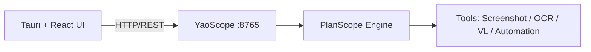

# Yao（妖）/ Yao — Windows 桌面 AI 助手（Tauri + React + YaoScope）

> **中文**：Yao 是一个 Windows 桌面应用，通过“截图 + 识别 + 自动化操作”的方式，把 AI 能力覆盖到任意桌面软件（聊天、浏览器、编辑器等），不依赖目标软件开放 API。  
> **EN**: Yao is a Windows desktop app that brings AI to any existing application (chat, browser, editor, etc.) via screenshot/OCR/VL + automation, without requiring those apps to expose APIs.

---

## 1. 项目功能 / Features

- **中文**
  - 截图识别：OCR / 视觉理解（VL）提取屏幕内容
  - 工作流驱动：PlanScope 负责“计划→执行→反馈”的流程编排
  - 桌面自动化：通过工具调用完成点击/输入/滚动等操作
  - 本地服务：后端为 **YaoScope（Python HTTP，端口 8765）**
- **EN**
  - Screen understanding via OCR / Vision-Language (VL)
  - Workflow-driven execution (PlanScope engine)
  - Desktop automation (click/type/scroll, etc.) via tools
  - Local backend service: **YaoScope (Python HTTP, port 8765)**

---

## 2. 架构 / Architecture



---

## 3. 5 分钟启动（开发）/ 5‑Minute Quick Start (Dev)

### 3.1 环境要求 / Requirements

- **Windows 10/11 x64**
- **Python 3.10+**
- **Node.js 18 LTS+**
- **Rust toolchain**（建议通过 `rustup` 安装 / recommended via `rustup`）

### 3.2 克隆 / Clone

```bash
git clone https://github.com/longdream/yao_ernie
cd yao_ernie
```

### 3.3 本地配置（不入库）/ Local config (never commit)

```bash
copy config\\settings.json.template config\\settings.json
```

- **中文**：`config/settings.json` 含 API Key，已在 `.gitignore` 中忽略，只能本地使用。  
- **EN**: `config/settings.json` contains API keys; it is ignored by `.gitignore` and must remain local-only.

配置字段说明见 / See config details: `config/README.md`

### 3.4 启动 / Start

```bash
start.bat
```

成功标志 / Success marker:

```text
=== START SUCCESS ===
```

---

## 4. 模型与大文件 / Models & Large Files

- **中文**：仓库不包含大模型文件（例如 `*.gguf`）。请把模型放在仓库外部磁盘路径（如 D 盘某目录），再在应用设置中填写模型路径。  
- **EN**: This repo does not ship large model files (e.g. `*.gguf`). Put models outside the repo (e.g. on another disk) and set the model path in app settings.

---

## 5. 目录结构 / Directory Layout

```
yao_ernie/
├── src/              # 前端（React + TypeScript）
├── src-tauri/        # Tauri Rust 端
├── YaoScope/         # Python 服务（唯一后端，8765）
├── models/           # 仅占位（不提交大模型）
└── start.bat         # 一键启动脚本
```

---

## 6. 常见问题 / Troubleshooting

### 6.1 服务未连接 / Service not connected

- **中文**：重新运行 `start.bat`，查看 `YaoScope/service_stderr.log` 与 `YaoScope/service_output.log`。  
- **EN**: Re-run `start.bat` and check `YaoScope/service_stderr.log` / `YaoScope/service_output.log`.

### 6.2 首次安装很慢 / First install is slow

- **中文**：首次启动会安装 OCR/ML 相关依赖，体积较大，属正常现象；后续启动会快很多。  
- **EN**: The first run installs large OCR/ML dependencies; later runs are much faster.

---

## 7. 安全与开源 / Security & OSS

- **中文**
  - 严禁提交：API Key / Token / 个人数据 / 日志 / 截图缓存 / 大模型 / 大文件
  - 安全问题请按 `SECURITY.md` 提交
- **EN**
  - Never commit: API keys/tokens, personal data, logs, screenshots/cache, large models, or binaries
  - Security issues: follow `SECURITY.md`

许可 / License: MIT

---

## 8. 参考 / Reference

本 README 的章节组织参考了 AIStudio 项目页常见结构（简介/功能/快速开始/配置/FAQ）。  
Reference page: `https://aistudio.baidu.com/projectdetail/9801787?channelType=0&channel=0`
