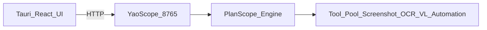

# Yao (妖) — Desktop AI Copilot for Any App (Tauri + React + YaoScope)
#
# Yao（妖）— 面向任意桌面应用的 AI 助手（Tauri + React + YaoScope）

<p align="center">
  
</p>

---

## Overview / 项目概述

**EN**: Yao is a Windows desktop app that overlays AI capabilities onto existing applications (chat apps, editors, etc.) without requiring those apps to provide APIs. It uses a local Tauri frontend and a Python HTTP service (**YaoScope**, port **8765**) to run PlanScope workflows and tools (screenshot/VL/OCR/automation).

**中文**：Yao 是一个 Windows 桌面应用，通过“依附式”交互把 AI 能力赋能到现有软件（聊天、编辑器等），不要求目标软件提供 API。前端是 Tauri + React，本地后端是 Python HTTP 服务 **YaoScope（8765）**，负责 PlanScope 工作流与工具（截图/VL/OCR/自动化）执行。

---

## Architecture / 架构



---

## Quick start (Dev) / 快速开始（开发）

### Requirements / 环境要求
- **Windows 10/11 x64**
- **Python 3.10+**
- **Node.js 18 LTS+**
- **Rust toolchain** (via `rustup`)

### 1) Clone / 克隆
```bash
git clone <your-repo-url>
cd yao
```

### 2) Configure (local only) / 配置（仅本地，不入库）
Copy template and fill your keys:

```bash
copy config\\settings.json.template config\\settings.json
```

**Important**: `config/settings.json` contains API keys and is **ignored by git**.

### 3) Start / 启动

```bash
start.bat
```

If everything is OK, it prints:

```text
=== START SUCCESS ===
```

---

## Models / 模型文件

**EN**: This repo does **not** ship large model files (`*.gguf`). Put your local models outside the repo (for example on another disk) and configure the model path in Settings. The project should not download models automatically.

**中文**：本仓库不包含任何大模型文件（`*.gguf`）。请把本地模型放到仓库外部（例如 D 盘其他目录），并在设置里填写模型路径。本项目不应自动下载模型文件。

---

## Troubleshooting / 常见问题

### Service not connected / 服务未连接
**EN**: Re-run `start.bat` and check YaoScope logs in `YaoScope/service_stderr.log` (auto-generated, ignored by git).

**中文**：重新运行 `start.bat`，并查看 `YaoScope/service_stderr.log`（运行时生成，已忽略，不会提交）。

### Dependency install is slow / 依赖安装较慢
**EN**: The first run may take time (OCR/ML deps are large). Subsequent starts are fast.

**中文**：首次启动需要安装依赖（OCR/ML 依赖较大），后续启动会快很多。

---

## Security / 安全

**EN**
- Never commit API keys, tokens, personal data, logs, screenshots, or models.
- If you find a security issue, please follow `SECURITY.md`.

**中文**
- 严禁提交 API Key / Token / 个人数据 / 日志 / 截图缓存 / 模型文件。
- 安全问题请参考 `SECURITY.md` 提交。

---

## License / 许可

MIT
