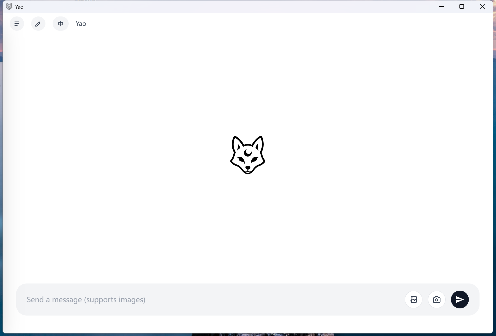
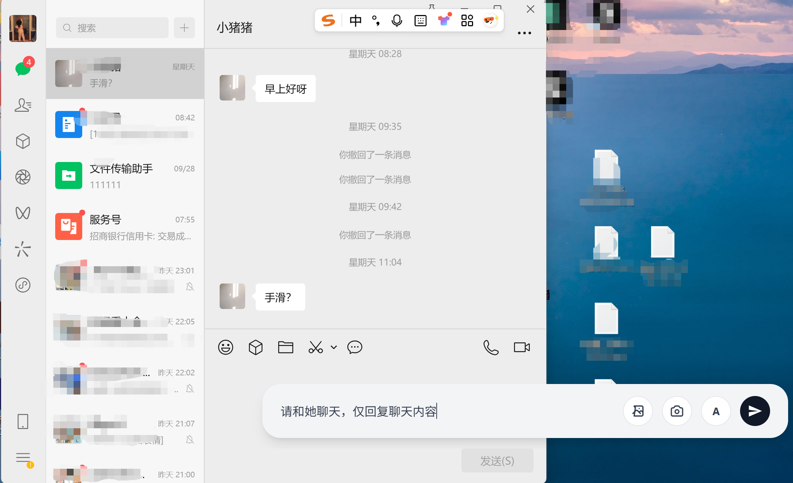

# Yao（妖）— 桌面 AI 助手

<p align="center">
  
</p>

---

## 一、项目简介

**Yao（妖）** 是一款面向 Windows 桌面的 AI 助手，通过 **截图识别 + 视觉理解 + 桌面自动化** 的方式，把 AI 能力赋能到任意桌面软件（微信、浏览器、编辑器等），**无需目标软件开放 API**。

用户只需截取屏幕区域，Yao 即可自动识别内容、理解上下文、执行操作（如回复消息、填写表单、滚动阅读等），实现"所见即所得"的智能交互体验。

---

## 二、功能特点

| 功能模块 | 说明 |
|---------|------|
| **屏幕识别** | 支持 OCR 文字提取 + Vision-Language（VL）视觉理解，准确识别屏幕内容 |
| **智能理解** | 基于大语言模型（LLM）分析用户意图，自动生成执行计划 |
| **工作流引擎** | PlanScope 引擎负责"计划 → 执行 → 反馈"的闭环编排 |
| **桌面自动化** | 支持鼠标点击、键盘输入、滚动、复制粘贴等自动化操作 |
| **记忆系统** | 支持对话记忆与向量检索，提升多轮交互连贯性 |
| **浮动窗口** | 始终置顶的悬浮球，随时唤起 AI 助手 |

<p align="center">
  
</p>

---

## 三、系统架构

```
┌─────────────────────────────────────────────────────────────┐
│                      Yao 桌面客户端                          │
│  ┌─────────────────────────────────────────────────────┐   │
│  │              Tauri + React 前端界面                   │   │
│  │  (浮动窗口 / 主界面 / 设置面板 / 截图工具)             │   │
│  └─────────────────────┬───────────────────────────────┘   │
│                        │ HTTP/REST                          │
│  ┌─────────────────────▼───────────────────────────────┐   │
│  │              YaoScope 服务 (Python :8765)             │   │
│  │  ┌─────────────────────────────────────────────┐    │   │
│  │  │              PlanScope 工作流引擎             │    │   │
│  │  │  (计划生成 → 任务分解 → 工具调用 → 结果汇总)   │    │   │
│  │  └─────────────────────────────────────────────┘    │   │
│  │  ┌─────────────────────────────────────────────┐    │   │
│  │  │                 工具池 (Tools)                │    │   │
│  │  │  截图 │ OCR │ VL视觉 │ LLM │ 自动化操作       │    │   │
│  │  └─────────────────────────────────────────────┘    │   │
│  └─────────────────────────────────────────────────────┘   │
└─────────────────────────────────────────────────────────────┘
```

### 核心组件说明

| 组件 | 技术栈 | 职责 |
|-----|-------|------|
| **前端界面** | Tauri 2.0 + React + TypeScript | 用户交互、截图、浮动窗口 |
| **YaoScope 服务** | Python FastAPI (端口 8765) | HTTP 服务，对接 PlanScope 引擎 |
| **PlanScope 引擎** | Python | 工作流编排：计划生成、任务执行、工具调度 |
| **工具池** | Python | 截图/OCR/VL/LLM/桌面自动化等工具实现 |

---

## 四、安装部署

### 4.1 环境要求

| 依赖项 | 版本要求 | 说明 |
|-------|---------|------|
| **操作系统** | Windows 10/11 x64 | 仅支持 Windows |
| **Python** | 3.10 或更高 | 用于 YaoScope 后端服务 |
| **Node.js** | 18 LTS 或更高 | 用于前端构建 |
| **Rust** | 最新稳定版 | 通过 [rustup](https://rustup.rs/) 安装 |

### 4.2 部署步骤

#### 第一步：克隆仓库

```bash
git clone https://github.com/longdream/yao_ernie.git
cd yao_ernie
```

#### 第二步：配置 API Key

```bash
copy config\settings.json.template config\settings.json
```

编辑 `config/settings.json`，填入你的 LLM API 配置：

```json
{
  "provider": "openai",
  "baseUrl": "https://your-api-endpoint",
  "apiKey": "your-api-key",
  "model": "your-model-name",
  "vlModel": "your-vl-model",
  "temperature": 0.7
}
```

> ⚠️ **注意**：`config/settings.json` 包含敏感信息，已在 `.gitignore` 中忽略，请勿提交到 Git。

#### 第三步：一键启动

```bash
start.bat
```

`start.bat` 会自动完成以下操作（按顺序）：

1. **创建 Python 虚拟环境** → `YaoScope/venv/`
2. **安装 Python 依赖** → 从 `YaoScope/requirements.txt`（首次约需 5-10 分钟）
3. **安装 Node.js 依赖** → 执行 `npm ci`（首次约需 1-2 分钟）
4. **启动 YaoScope 服务** → Python HTTP 服务，监听 `localhost:8765`
5. **健康检查** → 等待服务就绪（最多 30 秒）
6. **启动 Tauri 前端** → 开发模式，自动打开应用窗口

看到以下输出表示启动成功：

```
=== START SUCCESS ===
```

---

## 五、目录结构

```
yao_ernie/
├── src/                    # 前端源码（React + TypeScript）
├── src-tauri/              # Tauri Rust 后端
├── YaoScope/               # Python 智能服务（唯一后端）
│   ├── service/            # HTTP API 服务入口
│   ├── planscope/          # PlanScope 工作流引擎
│   │   ├── core/           # 核心：计划生成/执行/解析
│   │   ├── ace/            # ACE：上下文/反思/工具生成
│   │   └── tools/          # 工具注册与调度
│   └── requirements.txt    # Python 依赖清单
├── config/                 # 配置文件目录
│   ├── settings.json.template  # 配置模板（可提交）
│   └── settings.json       # 本地配置（不提交）
├── images/                 # README 截图
├── models/                 # 模型占位（不提交大文件）
└── start.bat               # 一键启动脚本
```

---

## 六、常见问题

### Q1: 启动失败，提示"YaoScope HTTP service failed to start"

**解决方案**：
1. 检查 Python 版本是否 ≥ 3.10：`python --version`
2. 查看错误日志：`YaoScope/service_stderr.log`
3. 确认端口 8765 未被占用：`netstat -ano | findstr 8765`

### Q2: 首次启动非常慢

**原因**：首次需要安装 OCR/ML 相关依赖（PaddlePaddle、PaddleOCR 等），体积较大。

**解决方案**：耐心等待，后续启动会很快。

### Q3: 如何配置不同的 LLM 服务商？

编辑 `config/settings.json`，修改以下字段：
- `provider`：服务商标识
- `baseUrl`：API 地址
- `apiKey`：API 密钥
- `model`：模型名称

详细配置说明见 `config/README.md`。

---

## 七、模型文件说明

本仓库 **不包含** 大模型文件（如 `*.gguf`）。如需使用本地模型：

1. 将模型文件放在仓库外部（如 `D:\models\`）
2. 在应用设置中配置模型路径

---

## 八、安全须知

- ❌ 禁止提交：API Key、Token、个人数据、日志、截图缓存、大模型文件
- ✅ 安全问题请按 `SECURITY.md` 流程提交

---

## 九、开源协议

本项目采用 **MIT License** 开源。

---

## 十、参考资料

- AIStudio 项目页：https://aistudio.baidu.com/projectdetail/9801787
- Tauri 官方文档：https://tauri.app/
- PaddleOCR：https://github.com/PaddlePaddle/PaddleOCR
